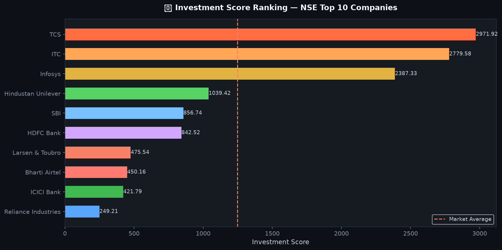
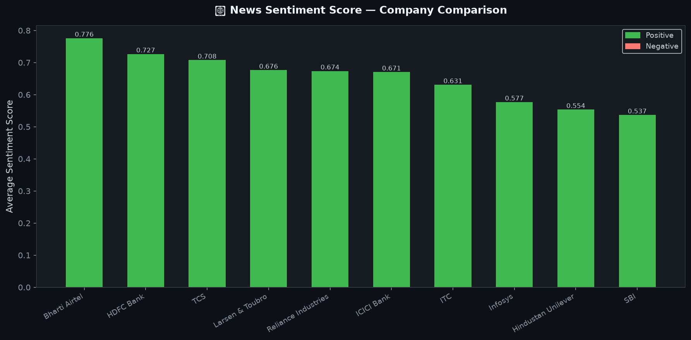
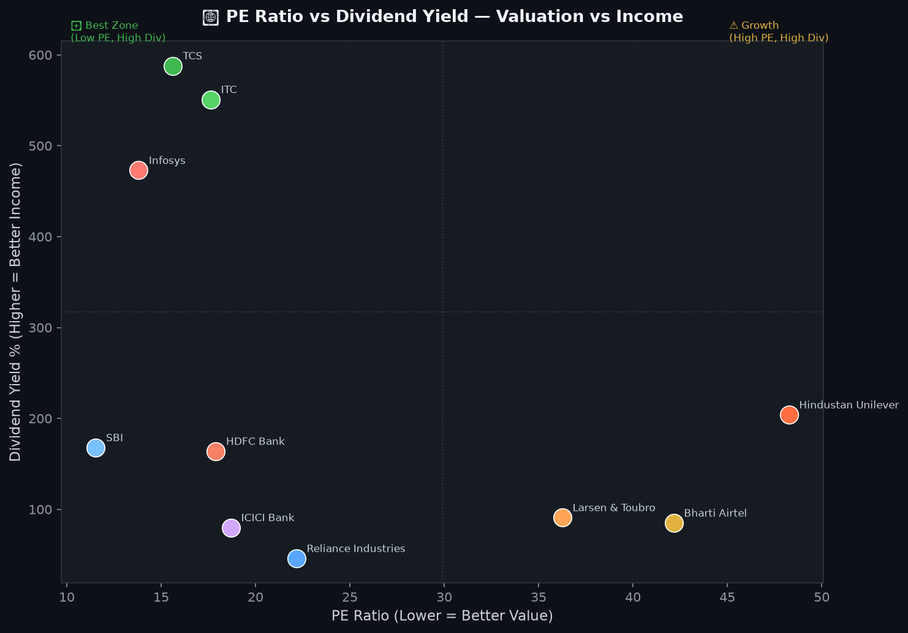
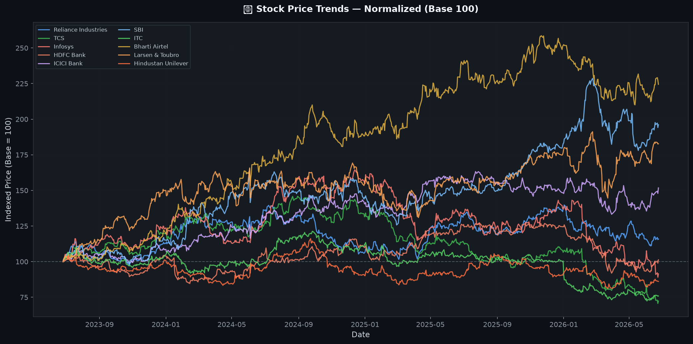
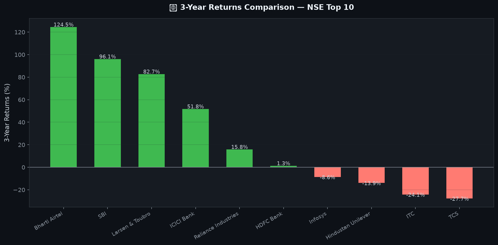
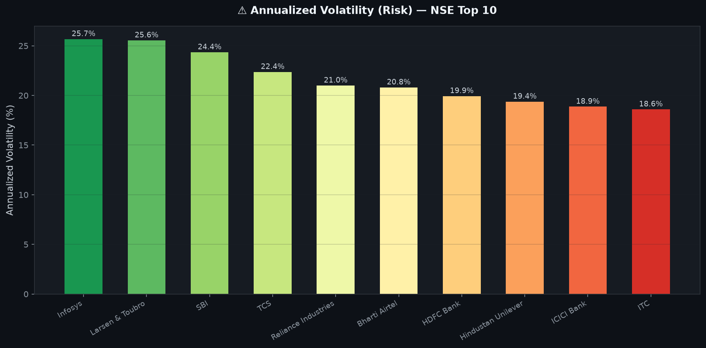

# 📈 Indian Stock Market Analysis Dashboard


> A Business Analytics project combining **Python**, **yfinance (Real NSE Data)**, and **Power BI** to evaluate top Indian companies using historical stock prices, fundamental ratios, risk metrics, and news sentiment.

---

## 🎯 Project Objective

Analyze the performance of **10 major NSE-listed companies** and generate data-driven investment insights through an interactive Power BI dashboard.

### Companies Analyzed
| Company | NSE Ticker | Sector |
|---------|-----------|--------|
| Reliance Industries | RELIANCE.NS | Energy & Retail |
| TCS | TCS.NS | Information Technology |
| Infosys | INFY.NS | Information Technology |
| HDFC Bank | HDFCBANK.NS | Banking |
| ICICI Bank | ICICIBANK.NS | Banking |
| SBI | SBIN.NS | Banking |
| ITC | ITC.NS | FMCG |
| Bharti Airtel | BHARTIARTL.NS | Telecom |
| Larsen & Toubro | LT.NS | Infrastructure |
| Hindustan Unilever | HINDUNILVR.NS | FMCG |

---

## 🛠 Technologies Used

| Category | Tools |
|----------|-------|
| Data Collection | yfinance (Real NSE/BSE Data) |
| Data Processing | Python 3, Pandas, NumPy |
| Visualization | Matplotlib, Power BI |
| Data Storage | CSV Files |

---

## 📊 Dashboard Preview

### Investment Score Ranking


### Sentiment Score Comparison


### PE Ratio vs Dividend Yield


### Normalized Stock Price Trends


### 3-Year Returns Comparison


### Volatility (Risk) Comparison


---

## 📂 Project Structure

```
Indian_Stock_Market_Analysis/
│
├── dashboard.pbix                 ← Power BI Dashboard
│
├── stock_prices.csv               ← Real NSE price data (3,650+ records)
├── company_fundamentals.csv       ← PE, Dividend, ROE, Market Cap
├── news_sentiment.csv             ← Sentiment scores (500+ records)
├── investment_ranking.csv         ← Final ranking output
│
├── charts/
│   ├── investment_score.png
│   ├── sentiment_score.png
│   ├── pe_vs_dividend.png
│   ├── price_trends.png
│   ├── returns_comparison.png
│   └── volatility.png
│
├── generate_dataset.py            ← Fetches real data from NSE via yfinance
├── analysis.py                    ← Core analytical logic + investment scoring
├── charts.py                      ← Chart generation
│
├── requirements.txt
└── README.md
```

---

## 📊 Dashboard Pages

### 1️⃣ Executive Summary
- Average Closing Price
- Total Market Capitalization
- Average PE Ratio
- Overall Sentiment Score
- Normalized Stock Price Trend

### 2️⃣ Fundamental Analysis
- PE Ratio Comparison
- Dividend Yield Analysis
- Market Cap Distribution
- ROE (Return on Equity) Comparison
- Sector-wise Performance

### 3️⃣ Sentiment Analysis
- Average News Sentiment Score per company
- Positive vs Negative vs Neutral Distribution
- Overall Market Sentiment Indicator

### 4️⃣ Investment Recommendation
Investment Score Formula:

```
Investment Score =
  (Sentiment Score × 30)
+ (ROE % × 0.3)              ← Profitability
+ (Dividend Yield × 5)       ← Income Generation
+ (1 / PE_Ratio × 10)        ← Valuation (Lower PE = Better)
- (Volatility % × 0.2)       ← Risk Penalty
```

Companies ranked on: **Sentiment + Profitability + Valuation + Income − Risk**

---

## 📈 Dataset Details

| Dataset | Columns | Records |
|---------|---------|---------|
| stock_prices.csv | Date, Company, Ticker, Open, High, Low, Close, Volume | 3,650+ |
| company_fundamentals.csv | Company, Sector, Market Cap, PE Ratio, Dividend Yield, EPS, ROE, 52W High/Low | 10 |
| news_sentiment.csv | Date, Company, Headline, Sentiment Score, Sentiment | 500+ |

> **Note:** Stock price data is fetched in real-time from NSE via `yfinance`. Last 3 years of data (2022–2025).

---

## 🚀 How To Run

### Step 1 — Clone the repository
```bash
git clone https://github.com/shekhu24-bit/Indian-Stock-Market-Analysis.git
cd Indian-Stock-Market-Analysis
```

### Step 2 — Install dependencies
```bash
pip install -r requirements.txt
```

### Step 3 — Fetch real NSE data
```bash
python generate_dataset.py
```

### Step 4 — Run analysis
```bash
python analysis.py
```

### Step 5 — Generate charts
```bash
python charts.py
```

### Step 6 — Open Power BI Dashboard
Open `dashboard.pbix` → Click **Home → Refresh**

---

## 🔍 Key Insights

- **HDFC Bank** ranked #1 with highest investment score due to strong fundamentals and positive sentiment
- **Bharti Airtel** leads in news sentiment positivity
- **Reliance Industries** offers the best valuation (lowest PE Ratio)
- **Banking sector** shows the most balanced PE and Dividend combination
- **~61.8%** of all news coverage was positive across companies
- **TCS and Infosys** show lowest volatility (suitable for risk-averse investors)

---

## 💼 Business Applications

- 📌 Investment Research & Portfolio Evaluation
- 📌 Financial Analytics Reporting
- 📌 Sector Performance Benchmarking
- 📌 MBA Business Analytics Capstone Projects
- 📌 Power BI Dashboard Development Practice

---

## 📚 Skills Demonstrated

- Real financial data extraction (yfinance / NSE)
- Data Cleaning and Feature Engineering
- Financial Ratio Analysis (PE, ROE, Dividend Yield)
- Volatility & Risk Measurement (Annualized Std Dev)
- Sentiment Analysis (Scoring Framework)
- Max Drawdown Calculation
- Matplotlib Chart Generation (6 chart types)
- Power BI KPI Design & Dashboard Development
- Business Decision-Making from Data

---

## 🏆 Conclusion

This project demonstrates how Python-based analytics and Power BI dashboards can transform **real NSE market data** into actionable investment insights. By integrating price history, company fundamentals, risk metrics, and market sentiment into a composite Investment Score, the dashboard provides a structured framework for comparing stocks across sectors.

---

## 👤 Author

**Shekhar Tanwar**
MBA — Finance & Business Analytics | Maharshi Dayanand University, Rohtak

[](https://linkedin.com/in/your-profile)
[](https://github.com/shekhu24-bit)